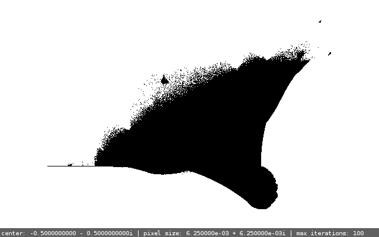
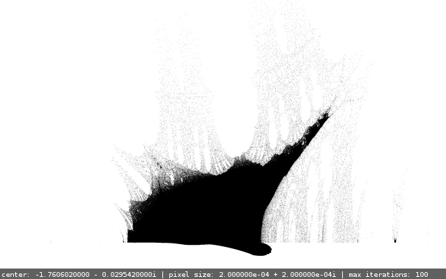
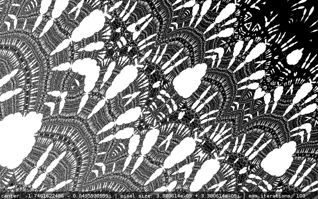
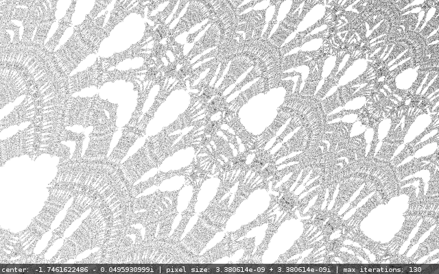
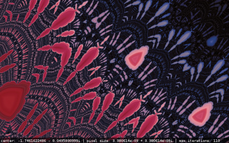

+++
title = "Burning ship"
date = 2013-12-17
taxonomies.tags = ["imported", "art"]

[extra]
comment = true
mathjax = true
+++
In this short article I'd like to present my longtime favorite complex plane fractal, the Burning
Ship. This will be very non-technical and non-scientific.

<!-- more -->

# A little theory

For a start, a bit of theory. Complex plane fractals are simply sets of complex numbers. Because
complex numbers are in fact pairs of real numbers, these fractals can be presented on a plane as
nicely-looking images.

For most standard fractals, we say that a complex number is part of the set if, after applying some
sort of iteration, it remains bounded. The iteration step is usually given as a simple mathematical
formula and to check whether the point is bounded, we perform an arbitrary maximum number of
iterations. If the point has not escaped from an arbitrarily chosen disc during iteration, we can
assume it's bounded. If it has, we make the assumption that it's unbounded.

The iteration formula for the Burning Ship fractal looks like this:

\$ z_0 = 0 \$

\$ z\_{n+1} = (\|\Re(z_n)\| + i\|\Im(z_n)\|)^2 + c \$

As you can see, it's very similar to the formula for the Mandelbrot set. The only difference is that
the real and imaginary parts of z are always kept nonnegative using absolute values. However, the
fractal itself is very different.

# Generation

The iteration starts from 0, then in each step the real and imaginary part of z are substituted with
their respective absolute values, the number is squared and c is added. In this example, c is the
actual complex number which is tested. A typical way to compute this and other similar fractals is
to iterate the formula at most M times, where M is an arbitrary maximum number of iterations. If z
hasn't escaped farther than N away from 0, it can be considered bounded, thus belonging to the
fractal set. Otherwise, we assume z is unbounded under the iteration and classify it as not
belonging to the set.

When you iterate like this for points in a complex rectangle between roughly \$-2.5-2i\$ and
\$1.5+i\$ and draw the bounded ones (fractal) in black and the unbounded ones (background) in white,
with a certain resolution (assume a certain "complex" size of a pixel) you should get an image which
looks more or less like this:

Well, this definitely doesn't look very cool, needless to mention it's much uglier than for example
the Mandelbrot set in my opinion. But the worst error to make here is to leave it right here. Take a
look at that little blob on the very left of the picture ("standing" on the line). Here is its
zoomed version:

The shape might not be interesting, but look what happens after the image is generated in higher
resolution and then scaled down (where every pixel in the lower resolution image is the average of
respective pixels in the hi-res image):

Better, isn't it? Now let's get a bit deeper into some arbitrary point in the grey mesh:

The possibilities are endless, and I dare claim that this fractal is much more diverse and
interesting than the Mandelbrot set, which seems to look the same on various levels of zoom. Though
all in all it's obviously a matter of taste and preference.

The interesting thing about this image and a lot of similar images is the fact that I have no idea
whether the gray points actually belong to the fractal set, because as you increase the maximum
number of iterations, the whole image gets more and more white and at about 500 iterations only a
couple of dots remain.

Take a look at the same fragment but at 130 iterations:

Because I have no idea about the more advanced math behind these beautiful things, I can only
suspect that the most interesting parts are not even the actual fractal, but rather the points which
escaped the iteration, but some of them managed to do it before the maximum number of iterations was
reached, and some other would do it a bit later.

The phenomenon observed in the previous images leads to the simple conclusion, that the points which
aren't part of the fractal are actually much more interesting and prettier. That's why it is worth
to color them nicely.

# Coloring

So far I've described how to tell if a complex number is in the set or not. Now let's get down to
coloring. There are various techniques of coloring non-fractal points, but all of them choose the
color depending on how fast the unbounded point escapes, usually by measuring the distance between
versions of z from 2 consecutive iterations. One of the easiest good-looking approaches to coloring
is using this formula:

\$ v(z) = n_e - \log_2\frac{\log \|z\_{n_e}\|} {\log(N)} \$,

where \$n_e\$ is the number of iteration where the point "escaped" (\$n_e = \min_n{z_n \> \|N\|}\$,
where \$N\$ is the bailout radius - the radius of the disc escaping from which signifies
unboundedness).

The real number \$v(z)\$ is called the Normalized Iteration Count (source: [García, Francisco; Ángel
Fernández, Javier Barrallo, Luis Martín. *Coloring Dynamical Systems in the Complex
Plane*](http://math.unipa.it/~grim/Jbarrallo.PDF)). This basically means that coloring this way is a
better version of coloring by the number of iteration in which the point escaped, because the result
is smoother. Having \$v(z)\$, we only need to multiply it by a constant factor, then take the
integral part modulo C, where C is the number of colors in the palette and this way we get the index
of color in the palette. I have decided to normalize \$v(z)\$ in such a way, that all colors from
the palette are used. This reduces one parameter (the scaling coefficient) and allows me to change
colors (shift the palette) by changing the maximum number of iterations.

Here are 2 images generated with different numbers of iterations, but the same color palette. As you
can see the maximum number of iterations changes not only the precision and level of detail (in fact
this changes only at the lower values), but also shifts the color palette, which is rather natural,
considering the fact that the color (or actually color number) depends on the speed at which the
point escapes. Makes sense if you think about it.

 

# One word on color palettes

So how to prepare a nice color palette, you may ask. It basically needs to meet 2 requirements. It
has to be large enough (a thousand colors seems fine) and it has to be smooth. The way I do it is:
find a nice gradient image or photo with smooth color transitions using google images, and then cut
a 1-pixel high strip of pixels. And that's your palette! You can see the results below.

# More eye-candy

Here you can check out a small gallery of little fragments of the Burning Ship set I've generated.

  

  

 
 

 
 

For those of you who want to have some of these on their desktops, here is a package with all those
images in hi-resolution without the bottom labels:
[burning_ship_hi_res.zip](burning_ship_hi_res.zip).

----------------------------------------------------------------------------------------------------

# Archived comments

*Below are the comments imported from the previous wordpress blog*

**Mikey** — *May 9, 2019 at 1:28 pm*

> What particular program did you use to visualize and assign colors to your chosen math there? I'd
> have loads of fun zooming and assigning colors. Great blog and thanks for sharing! ...And I just
> realized this was written in 2013 and so I bet this won't even get a reply 🙁

**komar** — *July 16, 2019 at 7:32 pm*

> Mikey,
>
> check it out here: <https://github.com/komar007/ssefract> Unfortunately, it's an old project I did
> on studies, may be hard to compile... Contact me here if you have problems.
>
> I've dropped you an e-mail. Check spam:)

----------------------------------------------------------------------------------------------------
