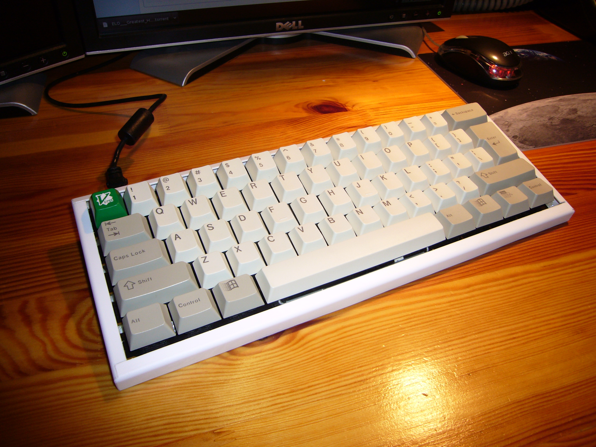

+++
title = "60% keyboard from a Cherry G80-8100"
date = 2015-09-05
taxonomies.tags = ["imported", "keyboards", "electronics", "hack"]
description = "how I turned a cheap Cherry POS keyboard into a 60% compact keyboard with a handmade plastic case"
+++

Here is an example of what you can do with your cheap POS Cherry keyboard if you have a few days and
some basic plastic cutting and soldering tools. This is not an instruction, but a description of my
mod written a couple of months after I made it, so it may be missing a few details. Feel free to ask
questions;)

*This article was written back in 2012 as a post on [geekhack.org](http://geekhack.org).
Unfortunately, the forum was having problems as a result of which the post lost its attachments. The
article below is a copy of the old post with attachments fixed.*

### TL;DR?

I built a 60% keyboard from a Cherry MX 8100 and an ikea cutlery container. It looks like this:

Thanks for reading.

### Not TL;DR?

Here it goes...

Firstly, a link: [G80-8113LRCUS-0 on eBay for
\$20](http://geekhack.org/showthread.php?17570-G80-8113LRCUS-0-on-eBay-for-20usd). I bought 3 of
these keyboards from rawko on ebay, because they were cheap, and I'd never tried Cherry Clears
before. One of the ideas was to build my first custom keyboard, so I thought this was a good source
of clears.

Anyway, I'll present how to modify the big cherry board with magnetic card swiper and turn it into a
60% compact keyboard. Or rather how to destroy the board completely, and then build a keyboard from
the parts and pieces. This is not an actual instructable, but it presents the basic steps of
building it and documents the process.

#### Step one

*shrink the keyboard to desired size, don't care for broken connections;)*

{{ link_thumb(path="P1140276.jpg", alt="the 60% block detached") }}
{{ link_thumb(path="P1140275.jpg", alt="keyboard in two parts") }}

*the 60% block detached (left) and keyboard in two parts (right)*

The photo on the left shows the pcb with all the switches but those I needed removed, after cutting
it into two parts — the 60% block for the new build and the unnecessary rest. You can see that I
removed the keycaps close to the cutting line, because my milling bit was touching them while
milling. I even destroyed one cap before I realized that. These diamond mills are real beasts, at
20,000 rpm you won't even feel you're milling through plastic or your finger!

The top part is pretty rough, because I didn't have any support, and I was basically holding the
board with my hands; the target board is already smoothed with sandpaper. There's one more thing I
didn't think about when milling, I should really have removed all the switches and resoldered them
after cutting, because the dust got inside and it took a long time to clean it later, even though I
had protected the switches with a solid layer of duct tape. In the background of the right photo is
the original keyboard (well, not exactly that same device obviously...)

#### Step two

*trace the matrix and check which connections you've destroyed*

After cutting out the main block, some of the matrix connections were obviously broken. I traced the
connections and it appeared that after connecting some sections together and fixing those
connections I had broken I could end up with an 8×8 matrix. Pretty good for a 61-key board.

Unfortunately I don't have a photo of the pcb with just the matrix fixed. In the next step you'll
see the added connections in the background. This Cherry board used switches with diodes, so you
have to be careful what you're connecting together to make sure you have all the cathodes/anodes on
either columns or rows.

#### Step three

*make the controller*

I wanted to have the keyboard working as soon as possible so I decided to prototype a controller in
as little time as possible. The result of this is an improvised device with just what is necessary
to get the ATmega32u4 up and running. I don't have any schematics, because I never made one, but
what you see below is basically a teensy 2.0 with the unnecessary stuff removed mounted on a tqfp
prototype board with leftover resistor/led leads used as connectors.

{{ link_thumb(path="P1140280.jpg", alt="improvised controller") }}
{{ link_thumb(path="P1140284.jpg", alt="controller and the main board") }}

*improvised controller (left) and controller and the main board (right)*

You can see some "innovative" solutions like wires going around the board to the other side or
additional drills, to make the USB B socket as stable as possible to prevent it from damage while
the cable is moving. The controller in these pictures is already connected to the pcb with a ribbon
cable. The other ends of the wires are soldered to switch pins chosen nearly randomly within nets in
a way which doesn't require too much mess in the cables. In the right picture is the controller laid
out as it should be with the ribbons routed and connected.

{{ link_thumb(path="P1140282.jpg", alt="bottom of the board connected", width=640) }}

*bottom of the board connected*

{{ link_thumb(path="P1140283.jpg", alt="ribbon cable wiring") }}
{{ link_thumb(path="P1140281.jpg", alt="controller - other side") }}

*ribbon cable wiring (left) and controller — other side (right)*

Above is the bottom of the board after connecting everything together. You can also see my desk and
my professional atx-fan-in-multimeter-box fume extractor;)

#### Step four

*if you don't know how to connect two parts together, use the glue gun... and regret it*

{{ link_thumb(path="IMAG0028.jpg", alt="glue!") }}

*glue!*

So I thought, this is a really dirty mod and I don't even know if I'm going to use it, so let's just
hot-glue the controller to the board. Well, even if I did have the photos of the thing glued, I
wouldn't show them here, but basically I didn't put anything between the two surfaces before
applying glue and I had shorts appearing randomly as I pressed the board with my hands. Believe me,
it's really hard to cut through hot-melt adhesive, even with a sharp exacto knife.

So after a few more hours I had the controller reattached and protected from shorts with the bottom
pcb. The gluing job looked even uglier, especially after I realized that it wouldn't fit in the case
(see step six — building the case) and had to remove some of the glue to lay the capacitors flat and
then reglue them to the board.

#### Step five

*clean your desk*

{{ link_thumb(path="P1140287.jpg", alt="improvised base - shot 1") }}
{{ link_thumb(path="P1140289.jpg", alt="improvised base - shot 2") }}
{{ link_thumb(path="P1140290.jpg", alt="improvised base - shot 3") }}
{{ link_thumb(path="P1140291.jpg", alt="improvised base - shot 4") }}

*improvised base — shots 1, 2, 3 (top row), and 4 (bottom)*

I downloaded the example USB HID code from the teensy project's page, replaced the dummy parts with
some matrix scanning and it basically started to work;)

Then I cleaned my desk and cut some cardboard and packing foam to form a sensible base for the
keyboard. Did I mention, that the thing couldn't even lay flat on the desk, because of the USB
socket on the left? After a few hours of use I decided to do something about the current "design",
because the front of the keyboard (space, modifiers, etc) was really too high. Time for a case!

#### Step five and a half

*clean the switches*

After cutting, a lot of dust got into the switches and some of them had some minor problems, like
not registering presses or registering them too many times. So I decided to clean everything
thoroughly to make sure the keyboard would work for some more time.

{{ link_thumb(path="P1140296.jpg", alt="P1140296") }}
{{ link_thumb(path="P1140298.jpg", alt="P1140298") }}
{{ link_thumb(path="P1140300.jpg", alt="P1140300") }}
{{ link_thumb(path="P1140301.jpg", alt="P1140301") }}

I removed the plastic tops (a bit tricky at first, but after a couple, it's really easy) and sprayed
the housings with compressed air. Then I sprayed the stems with "universal silicone oil" (that's
what the label said) and put some additional green grease of unknown origin on the bottom parts of
the stems. The whole process took about an hour and the switches started working much better, so I
think it was worth it.

#### Step six

*build the case*

{{ link_thumb(path="P1140292.jpg", alt="case parts") }}
{{ link_thumb(path="P1140295.jpg", alt="back side idea") }}

*case parts (left) and back side idea (right)*

I really got convinced that the 61 keys are more than enough for all my needs. Such layout has some
advantages, for example the mouse is as close to the hands while typing as possible. And you can
press enter with your right hand while it's resting on the mouse. So I was already using this board
as a daily-driver, but well, even considering my aesthetic requirements, this thing didn't look too
good. And it was sliding all over the desk. So I decided to make a case. But I'd never designed a
case in my life. Well, wait. I've never designed a case in my life.

{{ link_thumb(path="P1140294.jpg", alt="keyboard back") }}

*keyboard back*

The following description can't be treated as an instruction or anything like it, because it's
basically a few photos which I took while building the case. The process was not planned, so I don't
even know how I did it, but somehow the improvisation turned into a case. Maybe not a nice-looking
one, but still a case.

For the plastic, I chose an ikea cutlery container. The link is here: [IKEA cutlery
container](http://www.ikea.com/pl/pl/catalog/products/40177228/). For some reason they don't have
them on the US webpage, I don't know if they have them in the stores... The thing is really cheap
and I already had one at home so I thought, a case for a dollar? Why not;)

In the pictures you can see a part of the base of the container cut out to form the base of the
keyboard case. The long brim will be attached to the base to form the back finish, as shown in the
third picture. I had to make the back of the keyboard of two parts of plastic, because the brim of
the plastic thing was facing outwards which I really didn't like. All in all, I think that line
where the two parts join you'll see in the next pictures looks pretty good.

It appears that this kind of plastic is absolutely impossible to glue with nearly anything. I've
tried over 10 different plastic glues and none of them was able to form a connection that would
survive a light twist or pull. But what do you do if you can't glue something? Use the glue gun! I
can't really say that my glue gun glued this plastic well, but at least the case is in one piece and
if you don't throw it against a wall, it will survive a regular wear and tear. I have to say that
the plastic itself is very thin and flexible, so it's really not a good material for a case, but at
least it's very easy to cut.

{{ link_thumb(path="P1140310.jpg", alt="case corner") }}
{{ link_thumb(path="P1140314.jpg", alt="right side of the case") }}

*case corner (left) and right side of the case (right)*

I glued the two parts together and used another brim of the container to close the case on the side.
I also cut a hole for the USB connector. As you can see, the glue looks terrible, but that's the
interior. Nobody's going to look inside. After gluing I carefully cut the remaining plastic and
finished the surface with sandpaper. Then I used the brim again to make the front finish and the
other side and glued everything together with even more hot glue.

After some more cutting and sanding, this is the effect just after cleaning everything up:

{{ link_thumb(path="IMAG0029.jpg", alt="finished case", width=640) }}

As far as I remember, the case took me about 2 evenings to finish, mainly because of the lack of a
project and having just one plastic container, which I was afraid of destroying. And I also learned
one thing. Use protective glasses when cutting plastic with your drill!

#### Step seven

*put the keyboard into the case and finish the work!*

{{ link_thumb(path="IMAG0023.jpg", alt="mounting bolt") }}
{{ link_thumb(path="IMAG0024.jpg", alt="mounting bolts") }}

*mounting bolt (left) and mounting bolts (right)*

The pcb and controller are mounted with 2 bolts and 2 nuts on the lower side. The upper part of the
keyboard is not connected to the case, but since I don't use it in really hard conditions, it seems
unnecessary, especially with the USB connector holding it in place.

{{ link_thumb(path="IMAG0026.jpg", alt="PCB spacer") }}
{{ link_thumb(path="IMAG0030.jpg", alt="rubber foot") }}

*PCB spacer (left) and rubber foot (right)*

Before I put the keyboard into the case, I made 2 legs from plastic spacers (and hot-melt adhesive
of course) to keep the pcb in an angled position compatible with the case profile. In the end I
attached two rubber feet from the donor board, so that the keyboard didn't move all over the desk
while typing.

{{ link_thumb(path="P1140322.jpg", alt="finished board") }}
{{ link_thumb(path="P1140316.jpg", alt="finished board") }}

*finished board*

The firmware currently supports two layers and full NKRO over USB. I'm still working on it, because
it's now used in my Universal Keyboard Controller. If I ever manage to finish it, you can expect it
on geekhack;)

This mod would never have happened without the geekhack community. Thanks for your support and help
choosing keyboards and for making me aware of the existence of mechanical keyboards at all!
