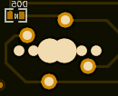
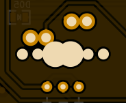

+++
title = "GH60 evolution"
date = 2013-08-10
taxonomies.tags = ["imported", "keyboards", "electronics", "gh60"]

[extra]
comment = true
+++
It's been some time since I last wrote about the GH60 project and much more than I had thought has
changed since then.

<!-- more -->

The rev. A prototype was to be just a testing board to make sure everything works all right before
we run the actual group-buy, but in fact the number of changes and extra features added since then
was so large that the rev. B is actually a new board.

In this post I'll try to quickly present the changes, new features and design decisions that make
the (hopefully) final version of this 60% programmable keyboard.

# Bugfixes

I mentioned a couple of errors I made in rev. A in the [first post about the
project](../introducing-the-gh60-keyboard-project/), and of course all of them are now fixed.

Some of these errors, like the wrong position of C3 or lack of some silkscreen legends were obvious
and easy to fix, but the rest did bring some more problems and required a certain dose of
compromise.

One of the most annoying problems of the previous version of the PCB was the necessity to mount some
of the switches rotated 90 degrees. As unimportant as it could seem, it is an actual problem. During
a discussion on geekhack someone brought to my attention the fact that the Cherry MX switch stems
are not perfectly "cross-shaped", as I had previously thought. And this caused keycaps to mount very
tightly on the stem making it very hard to remove the keycap and introducing a potential risk of
breaking the keycap stem.

<figure class="fig-left">

<figcaption>Both footprints rotated</figcaption>
</figure>

<figure class="fig-right">

<figcaption>Both "properly" rotated</figcaption>
</figure>

Since we obviously didn't want this to happen, I decided to put all the switches either in their
regular orientation or rotated 180 degrees (which shouldn't be a problem - a lot of keyboard
manufacturers do it anyway). This decision resulted in overlapping pads, but because there had
already been some overlapping pads, I just decided to agree with it. You can see the previous
version on the left and the new one on the right. In the end it's not that bad.

When making the rev. B I also fixed some dimension and hole position problems, like the stabilizer
holes being too close to PCB edges and the USB connector slightly misplaced. I'm still not sure all
the dimensions and positions are correct and I'm afraid I'll only find out when I finally get my
hands on the final prototype. Then I'll be able to tell what kind of final corrections we'll need to
make sure it fits everything well.

I have to say that measuring the Poker PCB, the case and making sure everything fits together was
probably the hardest part of the work. A lot of problems including a wrongly scaled ruler made it
even harder to debug the previously designed board, which I thought had already been correct. Each
time I was sure everything was done properly, it appeared there was something more I had not taken
into account. And when I finished it still appeared that the measurements made by other people were
slightly off. That may have been due to differences in cases (which is totally possible - the
tolerances aren't that great for plastic cases) or simply differing tools. Anyway, I'm hoping to get
to know if the board is OK soon.

# New features

The main reason to practically redesign the whole board was the number of new feature requests. Some
of the ideas were incorporated into GH60 and I'll quickly present them here.

- **Split backspace option (1)** - this was probably one of the most frequently requested features
  (well, maybe after backlighting), as it adds the only missing switch position which allows to
  replicate the HHKB layout. I decided to connect this extra switch to some unused matrix
  intersection in the lowest row, namely column 10, row 5.
- **Split enter option (2)** - I added one more switch position for enter to make it possible to
  implement a split enter option, where the ANSI enter key is 1u shorter and there's one more
  regular key in the home row (that key already has a footprint, because it's available in the ISO
  layout anyway) - you can think of this enter key as the ISO enter key with the top part cut off.
- **Extra backlit keys (3)** - since it wasn't possible to have a backlighting option where every
  LED can be controlled separately (extra chips just wouldn't have fit), I decided to at least use
  the 4 remaining JTAG pins and wire them to additional LED clusters: w-a-s-d (for gamers), Fn key
  on the right, "poker arrows" cluster (to light up the keys which change to arrows for Poker fans)
  and the escape key. Those clusters will be independently settable by the firmware.
- **Matrix rows breakout header (5)** - all 5 row signals of the keyboard matrix are available as
  pads where you can solder a header or wires directly. This together with the expansion port makes
  it possible to connect up to 20 more switches or the
  [GHPad](http://geekhack.org/index.php?topic=38963.0) board. In this case the
  [GHPad](http://geekhack.org/index.php?topic=38963.0) will not have to have any chips on board
  except diodes and it will extend the GH60's matrix instead of acting as a separate keyboard. This
  option is mainly for those who want to put the two keyboards in a common case and it blocks the
  backlighting option and 4 clusters of controllable LEDs since it uses the same signals.
- **Full backlighting LED matrix** - I added traces which make it possible to add full backlight to
  the board, this requires an add-on module, however.
- **A footprint for an expansion board (aka add-on module) (6)** - this can be the backlighting
  controller or any other extension module ever designed in the future, for example a bluetooth
  dongle. It sits under the board in the central top area. The signals available are: 14 LED
  columns, 5 LED rows, 4 general purpose pins (the same JTAG pins as used for LED clusters or
  [GHPad](http://geekhack.org/index.php?topic=38963.0) columns) and power (VCC and GND).

## LED backlighting design considerations

The GH60 keyboard was to be a non-backlit keyboard from the beginning. In fact the lack of
backlighting capability was one of the assumptions which was to simplify the whole board, but
because of high demand I did decide to change that in rev. B. There were a couple of ways of
implementing this feature, each with its own pros and cons.

One of the propositions I got on the forum was to just put pads, so that the user can solder the
diodes firmly and then wire all of them individually. This was of course my fallback option if
everything else failed, but I decided to try to do something better.

<figure class="fig-left" style="width: 150px;">

<figcaption>Diodes in parallel, one resistor per diode</figcaption>
</figure>

The next simplest option was probably to connect all LEDs in parallel. However, this has one
important drawback: every LED needs its own current-limiting resistor. Unfortunately, problems don't
end here. The value of this resistor depends on the type of diode, so the brightness would either
depend on the type of LED (color first of all) or I'd have had to add a high-power transistor to
implement PWM control. Needless to mention the extra cost of pick-n-place time to solder all the
resistors. Too many disadvantages, and no extra features, so I decided to think more.

<figure class="fig-right" style="width: 150px;">

<figcaption>Series of diodes in parallel, one resistor per 3 diodes</figcaption>
</figure>

The other option was to do it as it's done in most LED lighting systems, which is a mixed
(serial-parallel) topology. Here, we substitute each LED from the previous solution with a few of
them connected in series. The number of necessary resistors drops, but also the required voltage
rises. If the supply voltage is chosen in such a way that the voltage drop on the resistor is
similar to that of the previous circuit, the total power dissipated in the resistors is obviously
lower (*n* times where *n* is the number of resistors in each series pack). Since putting a step-up
converter on the board to pump up the voltage from USB's 5V was rather a no-go, I forgot about this
option very quickly.

And then I decided to go with what seems to be the most beefed-up version of backlighting, namely
matrix based circuit with multiplexed rows. It incorporates some advantages and some disadvantages
of the previously shown solutions, but it has one nice feature they don't have - it gives the
opportunity to control every LED separately if appropriate circuitry is provided - and this results
in endless modding capabilities. Because in this approach only one row is lit at a time, only 14
(number of columns) resistors are required, that's less than in the parallel-series solution with 3
LEDs in each series. The necessary switching circuit is of course more complicated that just a
voltage booster, but since neither would have fit in the board nicely, I knew I would have to make a
separate module anyway, so I chose this option. I also decided to put the current-limiting resistors
in the expansion module not to add more components to the board any more. I don't know how I'll fit
everything in this module yet, but I will have to, somehow.

<figure class="fig-center">

<figcaption>An excerpt from the schematic of the LED matrix</figcaption>
</figure>

I connected all the switch LEDs except those which are already connected in directly controllable
clusters, so assuming that the backlight module will require only one wire to communicate with the
main microcontroller, it's possible to have nearly all the diodes separately controllable. The
exceptions will be those connected in clusters (w-a-s-d and Poker arrows) - only the whole cluster
can be turned on or off; and one of the other directly connected LEDs, since one pin will have to be
used for communication with the module. If someone is very inclined to have fully independent
lights, they can always cut the traces of the LEDs already connected to the microcontroller and wire
the proper LED matrix intersections to the respective diodes, including the one which will have to
be disabled due to its use as a communication pin. That would be some serious modding, but it's
surely possible.

# Other changes

The board has also changed in a few more maybe less important aspects. One of the changes is ground
pour also on the top layer (the previous version only had it on the bottom). In fact I don't know
what drove me to that decision in rev. B, but since the highest frequency present in this design is
16MHz and it's just microcontroller clock, I don't really think it matters for signal integrity. Now
the ground pour is on both sides and it looks pretty.

I also changed some of the drill sizes and pad annular rings to simplify soldering by hand and I
fixed the mounting hole positions hoping that they will be fully correct this time. The official
logo was designed and picked by the geekhack community, so I also incorporated the new design into
the board.

Most of the changes introduced are documented in the [github issue
system](https://github.com/komar007/ghkb/issues?milestone=1&page=1&state=closed). Please check it
out for more information.

Here you can see how the keyboard's PCB has changed between rev. A and rev. B:

<figure>

[")](old_front.png) [")](old_back.png)

<figcaption>rev. A front & back</figcaption>
</figure>

<figure>

[")](new_front.png) [")](new_back.png)

<figcaption>rev. B front & back</figcaption>
</figure>

You can also download a [package with hi-res images](gh60_evo.zip).

# Next steps

The rev. B board is in prototype production now. The prototype is scheduled to ship on the 22nd of
August. When I get it, I'll be able to fix any minors errors and then finally start the volume
production of rev. C for the geekhack group-buy.

----------------------------------------------------------------------------------------------------

# Archived comments

**Phan Ha** — *January 30, 2014 at 1:56 am*

> waiting for RevC 🙁

**Jake** — *February 27, 2014 at 10:06 am*

> Man am I regretting just hearing about this now. I just decided to build a custom keyboard earlier
> today, and I'm really bummed I missed the GroupBuy.
>
> I'm planning on going with the KBT Pure layout, or something like it so I get a few extra keys.
> Then I'm going to solder the pads to some larger DIPs I've got lying around, and use them to
> control the LED zones, toggle a capslock and control swap, and toggle a qqwerty and Dvorak swap.
>
> Another idea is to use a 4th switch to toggle disabling the LED controls in favor of using those
> Aux JTAGS for a Bluetooth adapter, but where would I put the batteries? I kinda wish you went with
> the Teensy 2++, so there was support for more LED zones, the GHPad, possible Bluetooth, and
> `<a href="https://www.pjrc.com/store/dev_display_128x64.html" title="this">` dumb screen thing,
> but then it probobly wouldn't have fit in the same case'.
>
> What do you think komar? I'd love to hear your thoughts.

**komar** — *March 6, 2014 at 11:35 pm*

> Hi, the batteries will have to go somewhere between the PCB and the (bottom part of) the case.
>
> If the bluetooth module is used, I'm not sure how many LED clusters will be still usable. Probably
> at least 2 pins will be necessary to communicate with BT, so just 2 of 4 LED clusters will remain
> usable.
>
> Using the otherwise unused pads to control layout is a good idea, but it won't be possible to
> switch between LED clusters and BT. If BT is connected, it'll just take some of the aux pins and
> it won't be possible to use them for LEDs any more.

**Jay** — *December 1, 2014 at 2:19 am*

> Dear Komar,
>
> Don't know what happen, by accidently, my GH 60 lost all all key function. I tried to re-map the
> key, but somehow it doesn't work. On libusb, there isn't ay device with vid = 16c0 and pid = 047c.
> All my device are vid= 0xFEED and pid = 0x6060. I tried to choose the device with name " Interface
> 1 " however when I hit the program on guy.py, the cmd said " Run Time Error: no device found " .
>
> Is there any advice ? Please help me.
>
> Thank you for your time. Jay

**komar** — *December 10, 2014 at 9:55 pm*

> The discussion on this problem starts here:
> [<https://geekhack.org/index.php?topic=37570.msg1550676#msg1550676>](https://geekhack.org/index.php?topic=37570.msg1550676#msg1550676)

**Tv** — *December 15, 2017 at 10:00 am*

> Hi Komar,
>
> I got the rev.C pcb, and I can't figure out the polarity for leds, and the default location for
> 'fn' key. I usually split up right shift bar into 1.75 shift and 1u fn on the right. If I stick
> the led into that fn key will it work?

----------------------------------------------------------------------------------------------------
