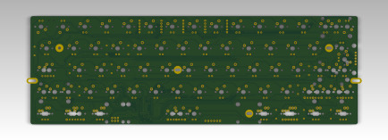

+++
title = "GH60 rev. C \"plain edition\" is out"
date = 2016-05-02
taxonomies.tags = ["imported", "electronics", "keyboards", "kicad", "gh60"]
description = "The latest edition of my 60% keyboard PCB design is released"
+++
I've been getting many questions concerning the files for the latest revision of
[GH60](http://gh60.info).

It took me a while to convert the KiCad files to the new version and do some final touches, but I
hope it was worth the wait!

All the development files are now available in the github repository
[komar007/gh60](https://github.com/komar007/gh60) (the name has changed, but your existing clones
will still work with the old one). The files are licensed under
[CC-BY-SA](https://creativecommons.org/licenses/by-sa/3.0/) (which you can see in the PCB artwork).

And here you can download all the production files in one zip package:
[gh60_revC_plain](gh60_revC_plain.zip). Please be advised that the files come with no warranty, and
I will take no responsibility for any loss which can be a result of a potential error in those
files.

# So what's the "plain edition" thing?

As you can see, the boards available through the geekhack group buy and from
[techkeys.us](http://techkeys.us) (USA) and [falbatech.pl](http://falbatech.pl) (Europe) contain the
geekhack community logo.

This logo is not present in the Creative Commons version just released. This is because the logo was
designed by a member of [geekhack.org](http://geekhack.org) and we believe its use should be limited
to approved vendors.

That's why the files for rev. C released publicly contain a different, more generic logo. The rest
of the board is, however, exactly the same. In particular, it does not differ electrically from the
GB PCB at all.
