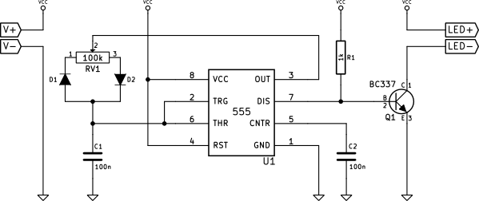
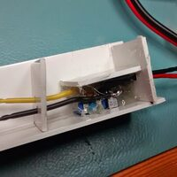
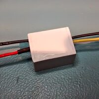
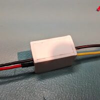
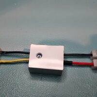
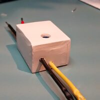

+++
title = "LED strip dimmer and potting attempt"
date = 2014-05-14
taxonomies.tags = ["imported", "electronics", "hack"]
description = "a quick build log of my super-simple dimmer for a LED strip"
extra.comment = true
+++
This is just a quick build log of my super-simple dimmer for a LED strip while I'm working on the
second part of [How to make a keyboard](/posts/how-to-make-a-keyboard-the-matrix/).

I needed a very simple LED dimmer for a short piece of LED strip I'm going to mount in the cupboard.
A quick google images search for "555 pwm" led me to this idea by Giorgos Lazaridis: [An LED Array
PWM Dimmer with the
555](https://web.archive.org/web/20251020190400/http://www.pcbheaven.com/circuitpages/LED_PWM_Dimmer/).

Here's the schematic of my version:

<figure>

<figcaption>555 based PWM LED dimmer schematic</figcaption>
</figure>

The circuit is rather simple. It's powered from a 12V supply. The 555 timer works in its regular
astable mode, where pins 6 and 2 (Threshold and Trigger) are shorted and are used to sense the
voltage across the capacitor C1. The charging/discharging circuit is, however, different than
usually. In order to achieve a reasonably stable frequency, the sum of charge and discharge times
must be independent from the duty cycle setting. For this reason, the capacitor is charged and
discharged using the two complementary halves of the pot RV1. Because these two virtual resistors
have to be connected to the same capacitor pin, diodes must be used to ensure the current flows only
through the right part while charging and only through the left part while discharging.

The capacitor is both charged and discharged using pin 3 (Output), because it is capable of both
sinking and sourcing current. When Output is high, the current flows through the right half of the
pot and D2 and charges the capacitor. When the capacitor is charged to approximately 2/3 of supply
voltage, Output transitions to low and the capacitor is discharged through D1 and the left half of
the pot. When the capacitor voltage drops below approximately 1/3 of supply voltage, Output
transitions back to high and the capacitor is charged again.

Pin 7 (Discharge) is used as this circuit's output, and its state follows that of pin 3 (Output).
Because this pin is an [Open Collector](http://en.wikipedia.org/wiki/Open_collector) output, it
needs a pull-up resistor R1. When it's low, the resistor wastes about 12mA of current. When it's
high, the resistor limits the base current of Q1, driving it to saturation, which in consequence
turns the LED load on. This means that the LEDs are on while C1 charges and off while it discharges.

# Building

After building a breadboard prototype and verifying that it works, I decided to keep the size as
small as possible and built the circuit without any PCB by directly soldering wires together.

<figure>

<figcaption>Dimmer front (left) and back (right)</figcaption>
</figure>

I managed to put R1 and C2 under the 555's dip package and also make some extra connections using
the remaining component wires. Then I squeezed D1, D2 and C1 under a pretty large pot I happened to
have. It was necessary to use some heat-shrink tubing to protect some wires from shorting. I also
protected the pot's stem with a bit of adhesive tape (sticky face up), so that the hot-melt glue I
was going to use wouldn't prevent it from turning. Next, I connected the two bundles together
(Output to the remaining pin of the pot and C1's sense line to Trigger and Threshold) and added the
transistor.

<figure>

<figcaption>The dimmer in a plastic case (left) and 3 walls done (right)</figcaption>
</figure>

The next step was to solder the 4 connection wires and build a mini plastic case. I decided to use a
plastic angle bar to form 2 walls of the case. I cut the two next walls out of the same plastic,
drilled holes for the wires and squeezed the circuit between them. Then I applied hot-melt glue to
temporarily connect the pieces together. In the image on the left the pot is laying face down and
there's a hole in the angle bar to allow for brightness control. After the left wall fell out for
some reason, I added the top one and filled everything with even more glue, treating it as a (very
poor) potting compound.

<figure>

<figcaption>All walls but one (left) and the last wall glued (right)</figcaption>
</figure>

I re-added the left wall, filled everything with as much glue as I could and pushed the precisely
crafted front wall inside. Making this wall required some patience as I wanted it to fit very
tightly to make sure there were no holes.

The final step was to cut all the remaining bits of plastic and make the whole device into a nice
box. I used a drill with a grinding disc to cut the plastic and then sandpaper to finish the rough
edges. This took a while but I was left with a not-very-nice-looking final product which I'm still
pretty satisfied with. Below, you can see pictures of the final stage:

As you can see, it's not a very pretty device, but hopefully it will work. Now I'll wait for the LED
strip to arrive to check it. My only concern is that when the transistor gets warm it might start to
melt the glue, and then the whole thing might fall apart. But time will show...

# Testing

<figure>

    

<figcaption>
From left to right: minimum brightness, duty cycle < 50%, ~50%, > 50%, maximum brightness
</figcaption>
</figure>

I hooked the dimmer up to some 3 white LEDs and a limiting resistor to test if everything worked
okay.

<figure class="fig-right">

</figure>

It did;)

On the right side I present the voltage plots of the LEDs and resistor in series. As you can see,
the frequency changes a bit with the duty cycle (the lower the duty cycle, the higher the
frequency), but it's still within acceptable range. You can also see the plots for the edge
positions of the pot (minimum and maximum brightness) on the left.

